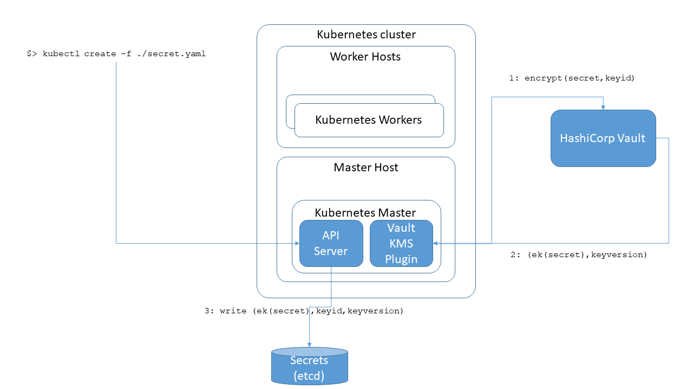

# k8s-KMS-vault
This repository contains code to deploy secret encryption at REST via a KMS system using a HashiCorp Vault deployment.
This implementation is based on https://kubernetes.io/docs/tasks/administer-cluster/kms-provider/. KMS is based on envelop encryption mechanism.

In particular, you will be able to enable the encryption of secrets via KMS of TLS certificates which will be used by a simple httpgo server.
So, the key components of this deployments are:
- HashiCorp Vault deployment (https://www.vaultproject.io/)
- Vault plugin (https://github.com/ttedeschi/kubernetes-vault-kms-plugin)
- httpgo: a basic HTTP server written in Go language (https://github.com/vkuznet/httpgo)

## Components details
The full workflow is described in the diagram below, taken from [oracle](https://github.com/oracle/kubernetes-vault-kms-plugin)


### HashiCorp Vault
Vault is an identity-based secrets and encryption management system.

### Vault KMS plugin
The Kubernetes KMS Plugin Provider for HashiCorp Vault implementation is a simple adapter that adapts calls from Kubernetes to HashiCorp Vault APIs using configuration that determines how the plugin finds the HashiCorp Vault installation. The plugin is implemented based on the Kubernetes contract as described in Implementing a KMS plugin.

### Httpgo
HTTPGO is a basic HTTP server written in Go language

## Requirements
- Kubernetes 1.10 or later
- Go 1.9 or later

## Quick start
Log into K8s master vm.

### Deploy vault server (developer mode - not to be used in production)
Install and deploy Vault server in development mode
```
curl -fsSL https://apt.releases.hashicorp.com/gpg | sudo apt-key add -
sudo apt-add-repository "deb [arch=amd64] https://apt.releases.hashicorp.com $(lsb_release -cs) main"
sudo apt-get update && sudo apt-get install vault
vault server -dev 
```
The output should be:
```
WARNING! dev mode is enabled! In this mode, Vault runs entirely in-memory
and starts unsealed with a single unseal key. The root token is already
authenticated to the CLI, so you can immediately begin using Vault.

You may need to set the following environment variable:

    $ export VAULT_ADDR='http://127.0.0.1:8200'

The unseal key and root token are displayed below in case you want to
seal/unseal the Vault or re-authenticate.

Unseal Key: 8XTzc+DuTplcRYzKXrgtlXhI7mdvYtSTOzKYXKsE5Os=
Root Token: <token>

Development mode should NOT be used in production installations!
```

  
### Deploy Vault KMS Plugin
Note: The KMS Plugin Provider for HashiCorp Vault must be running before starting the Kubernetes API server.

```
export GOHOME=$(go env GOPATH)
mkdir -p $GOHOME/github.com/oracle
cd $GOHOME/github.com/oracle
git clone https://github.com/ttedeschi/kubernetes-vault-kms-plugin.git
go install github.com/oracle/kubernetes-vault-kms-plugin/vault/server@latest
```

Create ```vault-plugin.yaml``` configuration file as shown in this file [vault-plugin.yaml](vault-plugin.yaml) putting the right token and the right address that you can retrieve from the output above:
```
keyNames:
  - kube-secret-enc-key
transitPath: /transit
addr: https://example.com:8200
token: <token>
```

Then run:
```
$GOHOME/bin/server -socketFile=<location of socketfile.sock> -vaultConfig=<location of vault-plugin.yaml>
```

### Enable KMS encryption in Kubernetes
The configuration of the api-server should be contained in a yaml file like this:

```
apiVersion: apiserver.config.k8s.io/v1
kind: EncryptionConfiguration
resources:
  - resources:
      - secrets
    providers:
      - kms:
          name: myKmsPlugin
          endpoint: unix://<location of socketfile.sock>
          cachesize: 100
          timeout: 3s
      - identity: {}
```
Change api-server configuration by modifying ```/etc/kubernetes/manifests/kube-apiserver.yaml```, inserting:
```
--encryption-provider-config=<path to encryption configuration yaml file>
```
```
- mountPath: <path to encryption configuration yaml file folder>
  name: encryptionConfig
  readOnly: true
```
```
- hostPath:
    path: <path to encryption configuration yaml file folder>
    type: DirectoryOrCreate
  name: encryptionConfig
```
The api-server should be restarted automatically by kubelet. In case of problems, debugging can be done looking at log files stored in ```/var/log/pods/kube-system_kube-apiserver*```.

### Test generic secret encryption
Data is encrypted when written to etcd. After restarting your kube-apiserver, any newly created or updated secret should be encrypted when stored. To verify, you can use the etcdctl command line program to retrieve the contents of your secret:
```
vault secrets enable transit
kubectl create secret generic secret1 -n default --from-literal=mykey=mydata
ETCDCTL_API=3 etcdctl [...] get /registry/secrets/default/secret1
```
where ```[...]``` indicates all useful arguments to connect to ```etcd```.
Verify the stored secret is prefixed with ```k8s:enc:kms:v1:``` which indicates the ```kms``` provider has encrypted the resulting data.
Finally, the output of the ``` kubectl get secret secret1 -o jsonpath='{.data}'``` command  should match ```mykey: bXlkYXRh```.

Now encryption via KMS is enabled.

### Test certificate encryption and use them in httpgo server
To test with certificates, create a personal certificate and put it into a secret:
``` 
openssl genrsa -out ca.key 2048
openssl req -x509 -new -nodes -days 365 -key ca.key -out ca.crt -subj "/CN=yourdomain.com"
kubectl create secret tls my-tls-secret --key ca.key --cert ca.crt
```
Define a configMap for the httpgo server in a ```httpgoConfigMap.yaml```
```
 apiVersion: v1
 kind: ConfigMap
 metadata:
   name: httpgo-config
   namespace: default
 data:
   httpgoConfig.json: |
    {
        "port": 8888,
        "serverkey": "/etc/certs/tls.key",
        "serverkey": "/etc/certs/tls.crt"
    }
```
And deploy it with ```kubectl apply -f httpgoConfigMap.yaml```

Then, define the deployment and service of an httpgo server that uses that configuration and that secret:
```
# create service
apiVersion: v1
kind: Service
metadata:
  name: httpgo
spec:
  type: NodePort 
  selector:
    app: httpgo
  ports:
  - port: 8888
    targetPort: 8888 
    protocol: TCP
    name: http
    nodePort: 31000
---
# create httpgo deployment
apiVersion: apps/v1 
kind: Deployment
metadata:
  name: httpgo
spec:
  selector:
    matchLabels:
      app: httpgo
  replicas: 1
  template:
    metadata:
      labels:
        app: httpgo
    spec:
      containers:
      - name: httpgo
        image: registry.cern.ch/cmsweb/httpgo@sha256:50b8811b2b9bb834457a0764c8277b6d7242a3eba0d1b76fcbbeb7f12392ab56
        command: ["/data/httpgo"]
        args: ["-config", "/etc/config/httpgoConfig.json"]  
        volumeMounts:
          - mountPath: "/etc/certs/"
            name: my-tls-secret
            readOnly: true
          - mountPath: "/etc/config"
            name: config-volume
        ports:
        - containerPort: 8888
        imagePullPolicy: Always
      volumes:
        - name: my-tls-secret
          secret:
            secretName: my-tls-secret
          volumes:
        - name: config-volume
          configMap:
            name: httpgo-config
```
And deploy it with ```kubectl apply -f httpgo.yaml```


